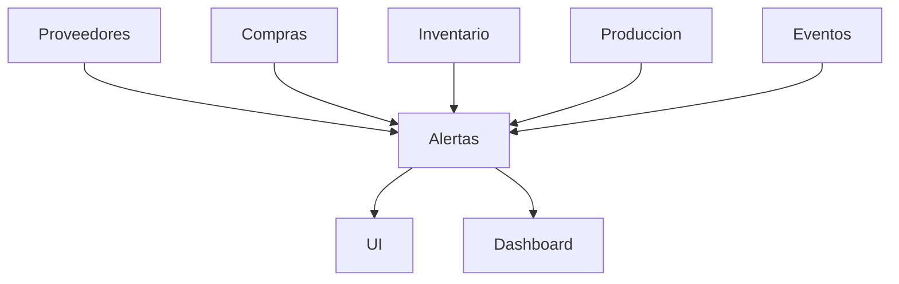

# Módulo Alertas y Notificaciones – ChefOS

## Objetivo
El módulo **Alertas y Notificaciones** centraliza todas las señales de riesgo y eventos relevantes generados por ChefOS.

No crea reglas de negocio ni cálculos.  
Su función es **decidir cuándo, a quién y cómo avisar**, evitando ruido y duplicidades.

Convierte ChefOS en un sistema **proactivo**, no reactivo.

---

## Principios clave

1. **Transversal**
   - Consume eventos de otros módulos
   - No bloquea flujos operativos

2. **Sin reglas propias**
   - La severidad viene determinada por el módulo origen

3. **Cero ruido**
   - No avisar si no hay impacto real
   - Priorizar eventos y producción

4. **Trazable**
   - Toda alerta queda registrada

---

## Orígenes de alertas

El módulo Alertas recibe eventos desde:

- Proveedores
- Compras y Pedidos
- Inventario / Stock
- Producción
- Eventos

Ningún módulo depende de Alertas para funcionar.

---

## Entidad principal

### Alerta
Representa una notificación única y accionable.

Campos:
- id
- hotel_id
- origen_modulo (proveedores, compras, inventario, produccion, eventos)
- origen_id (pedido_id, evento_id, lote_id, tarea_id, etc.)
- severidad (INFO, AVISO, CRITICO)
- titulo
- mensaje
- accion_sugerida (opcional)
- destinatarios (roles o usuarios)
- estado (activa, vista, resuelta)
- fecha_creacion
- fecha_resolucion (opcional)

---

## Severidad estándar

- 🟢 INFO → informativo, no requiere acción inmediata
- 🟡 AVISO → requiere atención
- 🔴 CRÍTICO → riesgo operativo real

La severidad **nunca se redefine aquí**: llega desde el módulo origen.

---

## Reglas de generación (ejemplos reales)

### Proveedores / Compras
- Pedido no llega a tiempo → CRÍTICO
- Pedido fuera de cut-off → AVISO
- Pedido no alcanza mínimo → AVISO

### Inventario
- Falta producto para evento → CRÍTICO
- Lote caduca en 48h → AVISO
- Merma elevada recurrente → AVISO

### Producción
- Tarea crítica no iniciada cerca del deadline → AVISO
- Tarea bloqueada demasiado tiempo → AVISO

### Eventos
- Evento con riesgo de abastecimiento → CRÍTICO
- Cambio de pax/menú con impacto → AVISO

---

## Destinatarios (MVP)

Las alertas se dirigen por **rol**, no por usuario individual:

- Jefe de cocina
- Compras

Regla:
- El personal operativo **no recibe alertas globales**
- Solo ve tareas asignadas

---

## Canales de notificación

### MVP 1
- In-app (campana / listado)

### MVP 2
- Resumen diario (digest)

### MVP 3
- Push móvil
- Email selectivo

---

## Deduplicación y control de ruido

Reglas mínimas:
- No generar la misma alerta activa dos veces
- Si el origen sigue sin resolverse:
  - actualizar timestamp
  - no duplicar mensaje
- Al resolverse el origen:
  - la alerta pasa a estado “resuelta”

---

## UI propuesta

### Lista de alertas (web)
- filtros:
  - severidad
  - módulo origen
  - activas / resueltas
- columnas:
  - severidad
  - título
  - módulo
  - fecha
  - estado

### Indicadores
- contador de alertas CRÍTICAS activas
- badge por evento con riesgo

---

## Integración con otros módulos

- Eventos: muestra alertas críticas asociadas al evento
- Compras: muestra alertas del pedido
- Proveedores: histórico de incidencias y alertas
- Dashboard (futuro): solo CRÍTICAS

---

## MVP recomendado

### MVP 1
- Modelo Alerta
- Alertas in-app
- Severidad INFO / AVISO / CRÍTICO
- Destinatarios por rol
- Deduplicación básica

### MVP 2
- Digest diario
- Agrupación por evento
- Silenciar avisos repetidos

### MVP 3
- Push móvil
- Reglas avanzadas por rol
- SLA y tiempos de reacción

---

## Diagrama de dependencias (Backend)

---

## Nota final
Alertas no es un módulo visible, es un **sistema nervioso**.

Si está bien diseñado:
- el usuario actúa antes de que el problema ocurra
- el dashboard tiene sentido
- la automatización futura es posible
