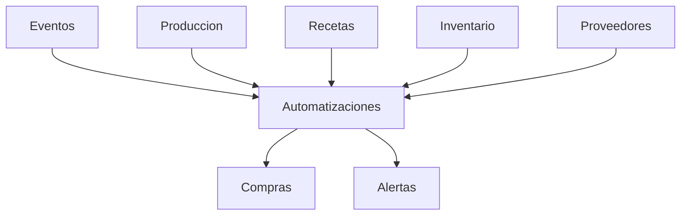

# Módulo Automatizaciones – ChefOS

## Objetivo
El módulo **Automatizaciones** convierte a ChefOS en un sistema **predictivo y asistido**, capaz de:
- sugerir pedidos antes de que haya problemas
- anticipar riesgos operativos
- reducir decisiones manuales repetitivas

Este módulo **no ejecuta acciones automáticamente en MVP**.
Propone, sugiere y alerta. El humano decide.

---

## Principios clave

1. **Asistido, no autónomo**
   - El sistema sugiere
   - El usuario confirma

2. **Basado en datos reales**
   - Eventos
   - Producción
   - Inventario
   - Proveedores
   - Históricos

3. **Sin reglas ocultas**
   - Toda automatización es explicable

4. **Impacto operativo primero**
   - Eventos y producción tienen prioridad sobre stock “bonito”

---

## Tipos de automatización

### 1) Pedidos sugeridos
### 2) Alertas predictivas
### 3) Recomendaciones operativas

---

## 1️⃣ Pedidos sugeridos

### Objetivo
Detectar **faltantes futuros** y proponer pedidos **antes** de que sean críticos.

---

### Fuentes de datos
- Eventos confirmados
- Producción planificada
- Recetas (cantidades escaladas)
- Inventario actual + lotes
- Proveedores (lead time, días entrega)

---

### Flujo lógico

1. Calcular necesidades futuras (por fecha)
2. Restar stock disponible real (FIFO + caducidades)
3. Agrupar faltantes por:
   - producto
   - proveedor preferido
4. Validar reglas del proveedor
5. Generar sugerencia de pedido

---

### Entidad: PedidoSugerido

Campos:
- id
- hotel_id
- proveedor_id
- fecha_necesidad
- fecha_sugerida_pedido
- estado (sugerido / aceptado / descartado)
- motivo (texto generado)
- creado_at

### PedidoSugeridoLinea
- pedido_sugerido_id
- producto_id
- cantidad_sugerida
- unidad
- evento_id (opcional)
- produccion_id (opcional)
- comentario

---

### Ejemplo de sugerencia
> 📦 Pedido sugerido a **Proveedor X**  
> Necesario para **Evento Boda 120 pax – 12/06**  
> Fecha recomendada de pedido: **08/06**  
> (lead time 72h)

---

### Acción del usuario
- ✅ Convertir en Pedido real
- ✏️ Editar cantidades
- ❌ Descartar sugerencia

---

## 2️⃣ Alertas predictivas

### Objetivo
Avisar **antes** de que el problema ocurra.

---

### Tipos de alertas predictivas

#### 🔴 Riesgo de falta de producto
Condición:
- stock proyectado < requerido futuro

Texto:
> 🔴 Riesgo de falta de **{Producto}** para **{Evento}**  
> Se recomienda realizar pedido antes de {fecha}

---

#### 🟡 Pedido sugerido fuera de ventana ideal
Condición:
- hoy > fecha_sugerida_pedido

Texto:
> 🟡 El pedido recomendado a **{Proveedor}** debería haberse realizado ya

---

#### 🟡 Proveedor crítico para próximos eventos
Condición:
- proveedor con incidencias recientes
- eventos próximos dependen de él

Texto:
> 🟡 El proveedor **{Proveedor}** presenta riesgo para eventos próximos

---

## 3️⃣ Recomendaciones operativas

### A) Ajuste de producción
Ejemplo:
- Producción elevada
- Merma histórica alta

Sugerencia:
> 💡 Considera reducir un **10%** la producción de {Receta}

---

### B) Priorización de consumo
Basado en:
- lotes con caducidad cercana

Sugerencia:
> 💡 Priorizar consumo de **{Producto}** (caduca en 48h)

---

### C) Cambio de proveedor (futuro)
Basado en:
- precio
- incidencias
- lead time

(MVP 3)

---

## Integración con Alertas

- Las automatizaciones **emiten eventos**
- Alertas decide:
  - severidad
  - destinatarios
  - canal

Automatizaciones **nunca notifican directamente**.

---

## UI propuesta

### Vista: Automatizaciones
Secciones:
1. Pedidos sugeridos
2. Riesgos detectados
3. Recomendaciones

Cada tarjeta muestra:
- motivo
- impacto
- acción sugerida

---

## Diagrama de dependencias (Backend)

---

## MVP recomendado

### MVP 1 (clave)
- pedidos sugeridos por eventos
- alertas predictivas de faltantes
- priorización por fecha de evento
- conversión manual a pedido

### MVP 2
- ajustes por producción real vs planificada
- alertas por proveedor crítico
- recomendaciones de consumo

### MVP 3
- scoring automático
- simulaciones “qué pasa si”
- auto-pedidos con aprobación

---

## Nota final
Automatizaciones es donde ChefOS empieza a **pensar**.

Si este módulo está bien diseñado:
- se reducen incendios
- compras deja de ser reactivo
- el sistema gana valor con el uso diario
