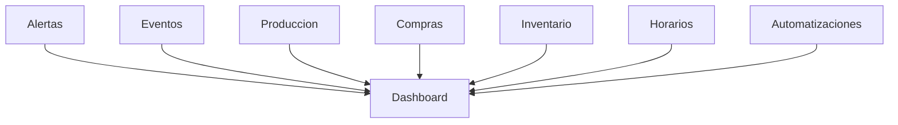

# Módulo Dashboard – ChefOS

## Objetivo
El **Dashboard** es una **vista de control**, no un módulo operativo.
No crea datos ni reglas: **consume información** de otros módulos para ofrecer una visión clara del estado del hotel.

Su función es responder rápidamente a:
- ¿Hay problemas hoy?
- ¿Qué eventos están en riesgo?
- ¿Dónde debo actuar primero?

---

## Principios clave

1. **Solo lectura**
   - El dashboard no modifica nada
   - Todas las acciones llevan al módulo origen

2. **Prioridad operativa**
   - Eventos
   - Producción
   - Abastecimiento
   - Personal

3. **Cero ruido**
   - Solo lo relevante
   - Las alertas mandan

4. **Rol-dependiente**
   - Jefe de cocina
   - Compras
   - Dirección (futuro)

---

## Fuentes de datos (dependencias)

El Dashboard consume información de:
- Alertas
- Eventos
- Producción
- Compras
- Inventario
- Personal y Horarios
- Automatizaciones

El Dashboard **no es dependencia** de ningún módulo.

---

## Estructura general

### 1️⃣ Barra superior (estado global)
- Hotel activo
- Fecha actual
- Indicadores rápidos:
  - 🔴 Alertas críticas activas
  - 📅 Eventos hoy
  - ⚠️ Eventos en riesgo

---

## 2️⃣ Bloques principales

### A) Alertas críticas (bloque principal)
Contenido:
- lista de alertas 🔴 activas
- ordenadas por:
  1. impacto en evento
  2. fecha

Acción:
- click → módulo origen (evento, pedido, producción…)

---

### B) Eventos próximos (hoy / próximos 7 días)
Por cada evento:
- nombre
- fecha/hora
- pax
- estado general:
  - ✅ OK
  - 🟡 Atención
  - 🔴 Riesgo

Indicadores:
- falta producto
- producción pendiente
- personal insuficiente

---

### C) Producción de hoy
Resumen:
- tareas pendientes
- tareas críticas no iniciadas
- tareas bloqueadas

Acción:
- ir a Producción (día)

---

### D) Compras y abastecimiento
Resumen:
- pedidos pendientes de recibir
- pedidos con retraso
- pedidos sugeridos activos (automatizaciones)

Acción:
- ir a Compras / Automatizaciones

---

### E) Personal y turnos (hoy)
Resumen:
- turnos del día
- déficit o sobrecarga
- ausencias (si aplica)

Acción:
- ir a Horarios (semana)

---

## KPIs simples (MVP)

- nº alertas críticas activas
- eventos en riesgo esta semana
- pedidos pendientes
- tareas críticas pendientes hoy

(No gráficos complejos en MVP)

---

## Comportamiento por rol

### Jefe de cocina
- ve todo excepto datos financieros
- foco en producción y eventos

### Compras
- foco en pedidos, proveedores y alertas de abastecimiento

### Dirección (futuro)
- KPIs agregados
- tendencias semanales

---

## UI / UX

- Diseño limpio
- Cards grandes
- Colores semáforo
- Responsive (tablet primero, móvil lectura)

---

## Diagrama de dependencias (Backend)

---

## MVP recomendado

### MVP 1
- Alertas críticas
- Eventos próximos
- Producción de hoy
- Compras pendientes
- Vista solo lectura

### MVP 2
- Filtros por fecha
- Resumen semanal
- Indicadores por departamento

### MVP 3
- Gráficos
- Comparativas
- KPIs históricos

---

## Nota final
El Dashboard no debe impresionar, debe **ayudar a decidir**.
Si las alertas están bien hechas, el dashboard casi se diseña solo.
