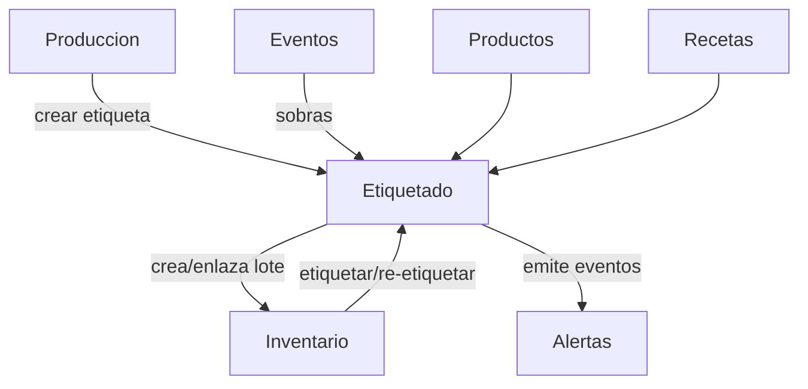

# Módulo Etiquetado y Trazabilidad (Preparaciones) – ChefOS

## Objetivo
El módulo **Etiquetado y Trazabilidad** permite crear e imprimir etiquetas para:
- **productos abiertos / re-envasados**
- **preparaciones elaboradas** (mise en place, salsas, fondos, etc.)
- **sobras / excedentes de eventos**
- **productos congelados / descongelados / pasteurizados / regenerados**

Conecta con una **impresora de etiquetas** y genera **código de barras** (o QR) para:
- añadir/identificar lotes en **Inventario**
- registrar movimientos (entrada/salida/merma) por escaneo
- activar **alertas de caducidad y trazabilidad**

---

## Principios clave

1. **Etiqueta = unidad trazable**
   - Todo lo que se guarda debe poder etiquetarse y localizarse.

2. **Mobile-first**
   - Crear + imprimir etiquetas en 10–20 segundos desde móvil/tablet.

3. **No duplicar Inventario**
   - La etiqueta crea o referencia un **LoteInventario**.
   - Inventario sigue siendo la fuente de verdad del stock y caducidades.

4. **Trazabilidad por origen**
   - Toda etiqueta puede vincularse a:
     - evento
     - tarea de producción
     - pedido/recepción
     - usuario

---

## Casos reales (por qué existe)

- Preparación para evento: “Salsa romesco 8L” → etiquetar con caducidad y origen evento.
- Producto abierto: “Queso rallado abierto” → etiquetar con fecha apertura y fecha límite.
- Congelación: “Caldo base” → etiquetar fecha congelación + fecha límite + lote.
- Descongelación: registrar fecha descongelado y nueva caducidad.
- Sobras de buffet: etiquetar “sobras” con reglas más estrictas y trazabilidad del evento.
- Pasteurizado/regenerado: registrar tratamiento y recalcular vida útil.

---

## Entidades (modelo funcional)

### PlantillaEtiqueta
Define el formato de impresión por hotel (sin overengineering).

Campos:
- id
- hotel_id
- nombre (ej.: “Preparación estándar”, “Producto abierto”, “Congelado”)
- tipo (preparacion / producto / sobras / congelado / pasteurizado)
- campos_visibles (json):
  - nombre
  - fecha_elaboracion
  - fecha_apertura
  - fecha_congelacion
  - fecha_descongelacion
  - fecha_caducidad
  - alergenos (opcional)
  - origen_evento (opcional)
  - ubicacion (opcional)
- activa (bool)

---

### Etiqueta
Representa una etiqueta impresa y su identidad (barcode).

Campos:
- id
- hotel_id
- codigo_barra (único)
- tipo (preparacion / producto / sobras)
- plantilla_id
- producto_id (opcional)  # si es producto
- receta_id (opcional)    # si es preparación basada en receta
- nombre_libre (opcional) # si no hay receta (ej.: “Salsa del día”)
- cantidad
- unidad
- fecha_elaboracion (opcional)
- fecha_apertura (opcional)
- fecha_congelacion (opcional)
- fecha_descongelacion (opcional)
- fecha_caducidad (obligatoria en MVP)
- tratamiento (enum opcional):
  - none
  - congelado
  - descongelado
  - pasteurizado
  - regenerado
- ubicacion_id (opcional)
- origen (enum):
  - produccion
  - evento
  - recepcion
  - manual
- evento_id (opcional)
- tarea_produccion_id (opcional)
- pedido_id (opcional)
- usuario_id (quien creó/imprimió)
- created_at

---

### EtiquetaInventarioLink
Conecta etiqueta con inventario (sin duplicar stock).

Campos:
- etiqueta_id
- lote_inventario_id

Regla:
- Al crear etiqueta, el sistema puede:
  A) crear un LoteInventario nuevo (preparación / re-envasado)
  B) asociarse a un lote existente (si se re-etiqueta)

---

## Reglas de caducidad (operativas)

### ReglaCaducidad (MVP simple)
Reglas por tipo (hotel configurable, pero con defaults).

Campos:
- id
- hotel_id
- tipo_etiqueta (preparacion / producto / sobras / congelado / descongelado / pasteurizado)
- vida_util_horas (ej.: 72h)
- requiere_caducidad (bool) = true
- activa (bool)

Comportamiento:
- Si el usuario no introduce fecha_caducidad:
  - el sistema la calcula usando vida_util_horas desde la fecha base:
    - elaboracion (preparación)
    - apertura (producto abierto)
    - descongelación (descongelado)
- Sobras de evento pueden tener vida útil más corta.

---

## Flujos de usuario (Mobile-first)

### 1) Crear etiqueta de preparación (desde Producción)
1. En una tarea de producción (receta/elaboración) → botón **“Etiquetar”**
2. Elegir cantidad + unidad
3. Seleccionar tratamiento (opcional: congelado/pasteurizado)
4. Sistema propone caducidad (editable)
5. **Imprimir**
6. (opcional) **Añadir a inventario** (crea lote)

Resultado:
- etiqueta creada
- lote creado en inventario (si se confirma)
- trazabilidad: tarea + usuario + fecha

---

### 2) Crear etiqueta de producto abierto (desde Inventario)
1. Seleccionar producto → **“Abrir / Re-envasar”**
2. Cantidad
3. Fecha apertura (auto = ahora)
4. Caducidad propuesta
5. Imprimir
6. Vincular a lote existente o crear lote nuevo (según caso)

---

### 3) Etiquetar sobras de evento (desde Evento o Inventario)
1. Evento → pestaña Inventario / post-servicio → **“Registrar sobras”**
2. Producto o preparación
3. Cantidad
4. Regla sobras aplica (caducidad corta)
5. Imprimir + añadir a stock (si se permite)

---

### 4) Escaneo (barcode) para movimientos
En Inventario (móvil):
- Escanear etiqueta → el sistema identifica lote
- Acciones rápidas:
  - Sacar (consumo)
  - Merma
  - Mover ubicación
  - Congelar / Descongelar (actualiza tratamiento + caducidad)

---

## Integraciones (dependencias)

### Inventario / Stock (principal)
- Etiquetas crean o enlazan **LoteInventario**
- Alertas de caducidad se basan en lotes/etiquetas

### Producción
- Botón “Etiquetar” en tareas
- Origen trazable por tarea/receta

### Eventos
- Etiquetas de sobras y preparaciones vinculadas al evento
- Auditoría post-evento (qué se guardó, qué se tiró)

### Alertas y Notificaciones
- Caduca en 48h / 24h (configurable)
- Sobras sin consumir (alto riesgo)
- Lotes sin etiqueta (si se registra manualmente)

### Productos / Recetas
- Producto_id / receta_id para consistencia de datos y escandallo

---

## Impresora y formato (MVP realista)

### Enfoque MVP
- ChefOS genera:
  - `codigo_barra`
  - payload de impresión (texto + barcode)
- La integración de impresora se resuelve por:
  - driver/conector (según hardware del cliente)
  - o export a PDF (fallback)
  - o integración con servicio de impresión local (fase 2)

### Recomendación
- Barcode: Code128 (simple) o QR (más info)
- Etiqueta mínima:
  - Nombre
  - Fecha elaboración/apertura
  - Fecha caducidad
  - Código barras
  - (opcional) Evento

---

## UI propuesta (resumen)

### Móvil – “Etiquetar”
- selector plantilla (por defecto según contexto)
- nombre (auto desde receta/producto)
- cantidad + unidad
- caducidad propuesta (editable)
- imprimir (botón grande)

### Web – Configuración (jefe/administración)
- plantillas de etiqueta
- reglas de caducidad por tipo
- listado de etiquetas (audit)
- métricas básicas:
  - etiquetas por semana
  - mermas de sobras

---

## Diagrama de dependencias (Backend)

---

## MVP recomendado

### MVP 1 (imprescindible)
- crear etiqueta (preparación / producto abierto / sobras)
- generar código de barras único
- imprimir (conector básico o PDF)
- vincular a lote de inventario
- escaneo para sacar/merma
- alertas básicas de caducidad

### MVP 2
- congelar/descongelar con recalculo de caducidad
- ubicaciones y “mover ubicación” por escaneo
- reportes de sobras por evento

### MVP 3
- OCR/parse de etiquetas externas (si aplica)
- recomendaciones automáticas (consumir antes)
- scoring de merma por tipo de preparación

---

## Nota final
Este módulo es clave para hoteles porque:
- evita errores de seguridad alimentaria
- aporta trazabilidad real
- convierte inventario en algo usable (no solo contable)

Si el equipo usa etiquetas, ChefOS se vuelve fiable y auditable desde el día 1.
