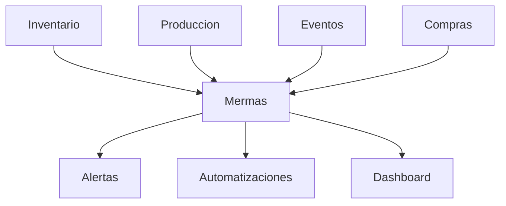

# Módulo Mermas y Mejora Continua – ChefOS

## Objetivo
El módulo **Mermas y Mejora Continua** permite **registrar, analizar y reducir desperdicio real** en cocina,
con trazabilidad completa del **qué, cuánto, cuándo y por qué**.

Este módulo NO depende de impresoras ni etiquetado físico.
La impresión y hardware quedan **explícitamente fuera del alcance actual**.

Su función es:
- entender dónde se pierde producto
- detectar patrones repetitivos
- ayudar a tomar decisiones para **reducir costes y errores**

---

## Principios clave

1. **Registrar es rápido**
   - Registrar una merma debe llevar menos de 10 segundos.

2. **Sin culpables, con datos**
   - El objetivo es mejorar procesos, no señalar personas.

3. **Trazabilidad total**
   - Toda merma puede vincularse a:
     - producto
     - evento
     - producción
     - proveedor
     - fecha y usuario

4. **Análisis simple y accionable**
   - Nada de BI complejo en MVP.
   - Comparaciones claras y entendibles.

---

## Qué es una merma en ChefOS

Se considera **merma** cualquier salida de producto que **no genera valor**:

- producto caducado
- sobreproducción
- error de preparación
- mala conservación
- rotura / accidente
- devolución o incidencia
- sobras no reutilizables de eventos

---

## Entidad principal: Merma

Campos:
- id
- hotel_id
- producto_id
- cantidad
- unidad
- fecha
- motivo (enum):
  - caducidad
  - sobreproduccion
  - error_preparacion
  - mala_conservacion
  - rotura_accidente
  - devolucion
  - sobras_evento
  - otros
- evento_id (opcional)
- tarea_produccion_id (opcional)
- proveedor_id (opcional)
- usuario_id
- comentario (opcional)
- created_at

Registrar una merma:
- descuenta stock (FIFO)
- queda registrada para análisis
- puede generar alertas

---

## Flujo de registro (Mobile-first)

### Registrar merma (desde móvil)

1. Acción rápida: **Registrar merma**
2. Seleccionar producto (búsqueda o favoritos)
3. Cantidad
4. Motivo (lista corta)
5. (Opcional) comentario / foto
6. Guardar

Tiempo objetivo: **≤ 10 segundos**

---

## Integración con otros módulos

### Inventario
- La merma siempre descuenta stock real.
- Se usa FIFO automáticamente.

### Producción
- Permite detectar:
  - recetas con sobreproducción
  - errores recurrentes en elaboraciones

### Eventos
- Permite analizar:
  - % de sobras por tipo de evento
  - eventos con mayor desperdicio

### Compras / Proveedores
- Detectar:
  - producto defectuoso
  - proveedor con incidencias repetidas

### Alertas
- Merma elevada de un producto → AVISO
- Repetición del mismo motivo → AVISO
- Merma crítica previa a evento → CRÍTICO

---

## Indicadores clave (MVP)

Indicadores simples y útiles:

- merma total por semana
- merma por producto (top 10)
- merma por motivo
- merma asociada a eventos
- merma asociada a producción

Valores:
- cantidad
- coste estimado (usando precio del producto)

---

## Vista de análisis (Web)

### Vista 1: Resumen semanal
- total mermas
- comparación vs semana anterior
- productos más afectados

### Vista 2: Por producto
- histórico semanal
- principales motivos
- eventos asociados

### Vista 3: Por evento
- producto desperdiciado
- porcentaje sobre producido
- reutilizado vs descartado (si aplica)

---

## Mejora continua (no automática en MVP)

El sistema **no corrige solo**, pero **sugiere**:

Ejemplos:
- “Este producto se tira un 18% más los lunes”
- “Esta receta genera sobreproducción recurrente”
- “Proveedor X concentra mermas por calidad”

Estas sugerencias alimentan el módulo **Automatizaciones** (fase 2).

---

## Decisión explícita: impresoras

🚫 **Fuera de alcance actual**
- integración con impresoras
- generación física de etiquetas
- hardware y drivers

✔️ **Dentro de alcance**
- trazabilidad digital
- análisis de mermas
- alertas y seguimiento

El etiquetado físico se retomará en un módulo independiente cuando el núcleo esté estabilizado.

---

## Diagrama de dependencias (Backend)

---

## MVP recomendado

### MVP 1 (imprescindible)
- registro rápido de merma desde móvil
- motivos estandarizados
- descuento automático de stock
- vistas básicas de análisis
- alertas simples

### MVP 2
- comparación por periodo
- sugerencias de mejora
- integración más profunda con producción

### MVP 3
- scoring de eficiencia
- benchmarks internos
- recomendaciones automáticas avanzadas

---

## Nota final
Reducir mermas es **dinero directo** y **mejora operativa real**.

Este módulo convierte datos incómodos en decisiones claras,
sin añadir fricción al día a día de cocina.
