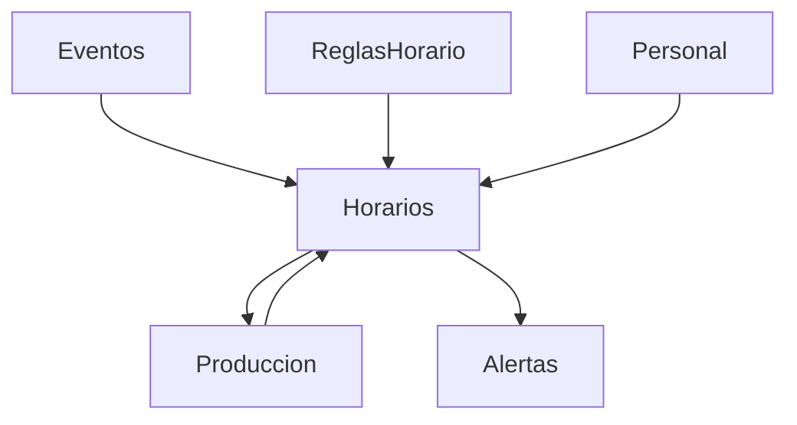

# Módulo Personal y Horarios – ChefOS

## Objetivo
El módulo **Personal y Horarios** gestiona:
- el personal operativo del hotel/restaurante
- la planificación de turnos
- la **generación automática de horarios** basada en reglas reales

Debe ser:
- coherente con Producción
- usable en vista mensual
- operable en ajuste semanal
- realista (no RRHH teórico)

No gestiona nóminas ni contratos laborales.

---

## Principios clave

1. **Horario al servicio de la operación**
   - Los eventos y la producción marcan la necesidad
   - El horario se adapta, no al revés

2. **Automático pero editable**
   - El sistema propone
   - El jefe valida y ajusta

3. **Reglas simples y explícitas**
   - Nada de IA opaca
   - Todas las reglas son visibles y comprensibles

4. **Coherencia**
   - Personal ↔ Horarios ↔ Producción ↔ Alertas

---

## Entidades principales

### Personal
Representa a una persona que trabaja en el hotel.

Campos:
- id
- hotel_id
- nombre
- rol_principal (cocinero, ayudante, jefe, etc.)
- roles_secundarios (opcional)
- tipo_contrato (info ligera)
- horas_semanales_objetivo (ej. 40)
- disponibilidad (opcional)
- activo (bool)

---

### Turno
Bloque horario reutilizable.

Campos:
- id
- hotel_id
- nombre (mañana, tarde, noche, refuerzo)
- hora_inicio
- hora_fin
- tipo (normal / refuerzo / evento)
- activo

---

### ReglaHorario
Define cómo se generan los horarios automáticamente.

Campos:
- id
- hotel_id
- rol
- dias_semana (L/M/X/J/V/S/D)
- turno_id
- personas_minimas
- personas_maximas (opcional)
- prioridad (normal / alta)
- activa

Ejemplo:
- Rol: cocinero
- Días: L–V
- Turno: mañana
- Personas mínimas: 3

---

## Generación automática de horarios

### Fuentes de datos
- ReglasHorario
- Eventos confirmados
- Producción planificada
- Disponibilidad del personal
- Horas ya asignadas

---

### Flujo de generación (mensual)

1. Seleccionar mes
2. Sistema calcula necesidades base por reglas
3. Incrementa necesidades si hay:
   - eventos
   - picos de producción
4. Asigna personal disponible:
   - respetando horas objetivo
   - evitando sobrecarga
5. Genera **HorarioPropuesto**

---

### Entidad: HorarioPropuesto
- id
- hotel_id
- fecha
- turno_id
- personal_id
- origen (regla / evento / ajuste)
- estado (propuesto / confirmado)

---

## Vistas de usuario

### Vista mensual (principal)
Pensada para **planificación**.

- calendario mensual
- cada día muestra:
  - turnos
  - nº personas asignadas
- colores:
  - completo
  - justo
  - déficit

Acciones:
- generar mes
- bloquear días
- editar asignaciones

---

### Vista semanal (operativa)
Pensada para **ajuste fino**.

- vista por semana
- filas: personal
- columnas: días
- cada celda:
  - turno asignado
  - editable drag & drop

---

## Integración con Producción

Regla clave:
> Una tarea de Producción solo puede asignarse a personal con turno activo ese día.

Producción consulta Horarios para:
- sugerir asignaciones
- detectar sobrecarga
- generar alertas

---

## Alertas relacionadas

Ejemplos:
- 🔴 Falta personal en turno crítico
- 🟡 Persona supera horas semanales objetivo
- 🟡 Evento con refuerzo no cubierto

Estas alertas se envían al módulo **Alertas**.

---

## Reglas anti-caos (obligatorias)

- No asignar:
  - dos turnos solapados
  - más horas de las permitidas (configurable)
- Permitir excepciones manuales (registradas)
- Registrar cambios:
  - quién
  - cuándo
  - por qué

---

## UI móvil (personal)

Vista simple:
- “Mi horario”
- vista semanal
- turnos asignados
- tareas de producción vinculadas

Sin edición desde móvil.

---

## Diagrama de dependencias (Backend)

---

## MVP recomendado

### MVP 1
- Alta de personal
- Definición de turnos
- Reglas básicas de horario
- Generación automática mensual
- Ajuste semanal manual

### MVP 2
- Integración más fina con producción
- Alertas de déficit/sobrecarga
- Bloqueo de días

### MVP 3
- Preferencias personales
- Refuerzos automáticos por evento
- Simulación de escenarios

---

## Nota final
Este módulo no pretende sustituir a RRHH.

Su objetivo es que:
- la cocina funcione
- la planificación sea coherente
- el jefe tenga control sin hacer horarios a mano cada semana
