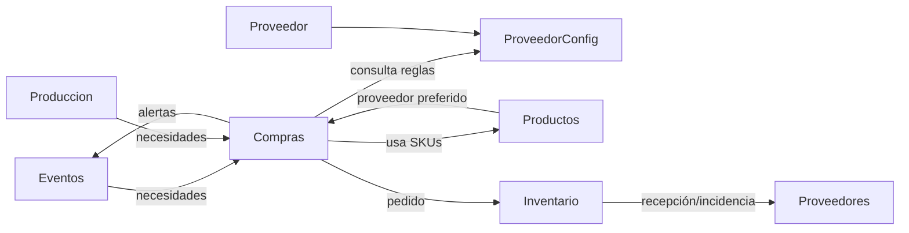

# Módulo Proveedores – ChefOS

## Objetivo
El módulo **Proveedores** define y gobierna las **reglas operativas reales de suministro** en ChefOS.

No es un CRM ni un módulo financiero.  
Su función es permitir que **Compras, Productos, Inventario y Eventos** operen sin errores, anticipando riesgos y automatizando validaciones.

---

## Principios clave
1. Proveedor ≠ Producto  
2. Reglas automáticas, no manuales  
3. Operación diaria > configuración  
4. Incidencias y métricas generadas automáticamente  

---

## Entidades principales

### Proveedor
- id
- hotel_id
- nombre_comercial
- tipo_proveedor (alimentación, bebidas, limpieza, otros)
- contacto_principal (opcional)
- email_pedidos (opcional)
- telefono (opcional)
- notas_operativas
- activo

### ProveedorConfig
- proveedor_id
- hotel_id
- dias_entrega (L/M/X/J/V/S/D)
- hora_corte_pedido
- lead_time_min_horas
- pedido_minimo_importe (opcional)
- pedido_minimo_unidades (opcional)
- ventana_recepcion_inicio (opcional)
- ventana_recepcion_fin (opcional)
- permite_entrega_urgente

---

## Integraciones entre módulos

- Productos: referencias (SKU), precios, proveedor preferido
- Compras: validación automática de pedidos
- Inventario: incidencias por recepción
- Eventos / Producción: alertas de riesgo operativo

---

## Incidencias de proveedor

### IncidenciaProveedor
- id
- proveedor_id
- pedido_id
- tipo_incidencia (retraso, falta_producto, sustitucion, error_referencia, calidad)
- gravedad (baja, media, alta)
- impacto_evento
- comentario
- fecha

---

## Métricas automáticas
- % pedidos completos
- % entregas a tiempo
- incidencias últimos 30 días
- incidencias con impacto en eventos

---

## Alertas automáticas

Severidad:
- INFO
- AVISO
- CRÍTICO

Ejemplos:
- Pedido no llega a tiempo → CRÍTICO
- Pedido fuera de cut-off → AVISO
- Recepción incompleta con impacto → CRÍTICO

---

## Diagrama de dependencias (Backend)

---

## MVP

### MVP 1
- Alta/edición proveedor
- Configuración operativa
- Validación automática en compras
- Incidencias automáticas
- Métricas básicas

### MVP 2
- Mínimos y ventanas de recepción
- Impacto visual por evento

### MVP 3
- Scoring y comparativas

---

## Nota final
Proveedores es un **motor silencioso** que evita errores, anticipa problemas y hace que ChefOS funcione de forma predictiva.
